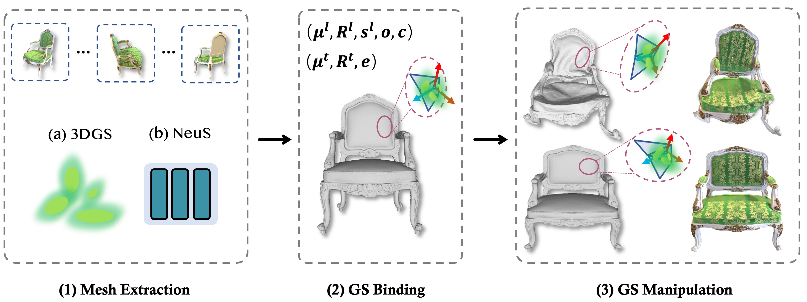

# Mani-GS: Gaussian Splatting Manipulation with Triangular Mesh

### 
[Project Page](https://gaoxiangjun.github.io/mani_gs) | [ArXiv](https://arxiv.org/abs/2405.17811)

<a href="" target="_blank">Xiangjun Gao1</a>, 
<a href="" target="_blank">Xiaoyu Li2</a>, 
<a href="" target="_blank">Yiyu Zhuang3</a>, 
<a href="" target="_blank">Qi Zhang2</a>, 
<a href="" target="_blank">Wenbo Hu2</a>, 
<a href="" target="_blank">Chaopeng Zhang2<i class="fa fa-envelope"> </i></a>, 
<a href="" target="_blank">Yao Yao3<i class="fa fa-envelope"> </i></a></h5>,
<a href="" target="_blank">Ying Shan2</a>
<a href="" target="_blank">Long Quan1</a>
 1HKUST 2Tencent 3Nanjing University

This is the official implementation of 3D Gaussian manipulation for the paper *Mani-GS: Gaussian Splatting Manipulation with Triangular Mesh*.

**The code will be released in June.** We are cleaning our code for better use and evaluation, please stay tuned. 

## Overview

